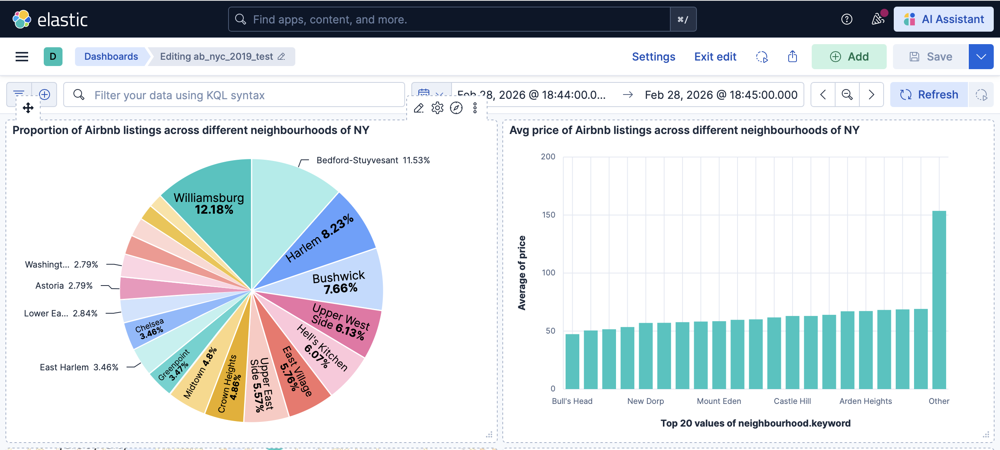
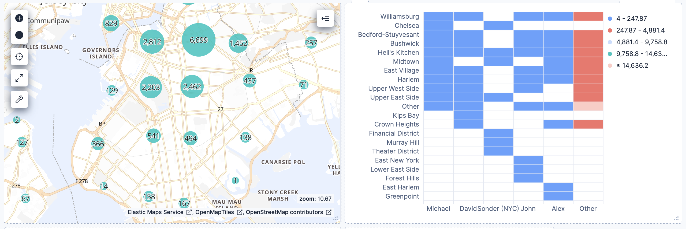
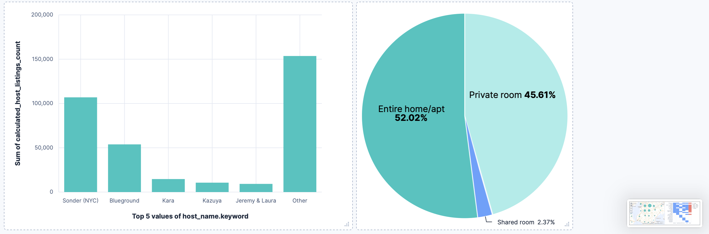

# 📊 Kibana Dashboard Using ELK Stack
Kibana Dashboard on ab_nyc_2019 dataset using ELK Stack

---

## 📌 Project Overview

This project demonstrates the implementation of a complete ELK Stack pipeline using:

- Logstash for ingesting data from csv file and transforming it.
- Elasticsearch for data storage and indexing.
- Kibana for visualization and dashboard creation.


The dashboard analyzes a Airbnb listings dataset and provides insights using Elasticsearch queries.\
Dataset: https://www.kaggle.com/datasets/dgomonov/new-york-city-airbnb-open-data


---

## 🖼️ Dashboard Screenshots




---

## 🏗️ Architecture
Data(CSV) → Logstash → Elasticsearch → Kibana


---

## 🛠️ Tech Stack

- Logstash
- Elasticsearch  
- Kibana  


---

## ⚙️ Setup Instructions

### 1️⃣ Download Elasticsearch, Kibana and Logstash

- Download and setup Elastisearch,https://www.elastic.co/downloads/elasticsearch
- Download and setup Kibana, https://www.elastic.co/downloads/kibana
- Download and setup Logstash, https://www.elastic.co/downloads/logstash

### 2️⃣ Start Elastisearch and Kibana

```bash
#Run this in Terminal or Command Prompt
#Start Elasticsearch
./bin/elasticsearch
#Note down the Access Token, Username and Password, which will be used to access Kibana

#Start Kibana
./bin/kibana

# After running Elasticsearch and Kibana, Run the logstash command to ingest data into Elasticsearch
logstash -f ./logstash/logstash.conf
```

### 3️⃣ Access Services

Access Running status of Elasticsearch on: http://localhost:9200 \
Access Kibana on: http://localhost:5601
